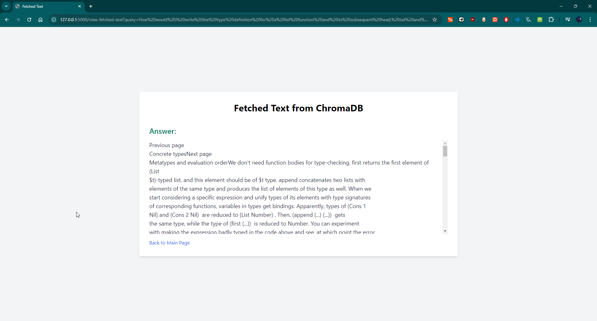

### Answers to the Questions

1. **Different Kinds of Similarity Search & Their Metrics**:
   - **Cosine Similarity**: Measures the cosine of the angle between two vectors. It's often used in text similarity tasks because it normalizes the length of the vectors, focusing purely on the orientation. 
     - *Metric*: Cosine of the angle between vectors, with values ranging from -1 (completely dissimilar) to 1 (completely similar).

   - **Euclidean Distance**: Measures the straight-line distance between two points in a multi-dimensional space. It’s a straightforward measure of similarity but doesn’t account for the magnitude of the vectors.
     - *Metric*: Square root of the sum of squared differences across all dimensions.

   - **Manhattan Distance**: Also known as L1 distance, it sums the absolute differences between the coordinates of the vectors. It's useful in grid-like or high-dimensional spaces where direct distance measures might not capture similarity well.
     - *Metric*: Sum of absolute differences between vector components.

   - **Jaccard Similarity**: Used for comparing the similarity between finite sets, often in cases like text documents represented as sets of words.
     - *Metric*: Ratio of the intersection to the union of two sets.

   - **Dot Product**: Measures the magnitude of similarity by directly multiplying corresponding elements of two vectors and summing the results.
     - *Metric*: Sum of products of corresponding vector elements; higher values indicate higher similarity.

2. **Mitigating the Slowness of Nearest Neighbor Similarity Calculation**:
   - **Approximate Nearest Neighbor (ANN)**: Instead of finding the exact nearest neighbor, ANN methods like HNSW (Hierarchical Navigable Small World) or LSH (Locality Sensitive Hashing) provide approximate solutions much faster. These methods trade off a bit of accuracy for significantly improved speed, especially useful in large datasets.
   - **Vector Indexing**: Using libraries like FAISS (Facebook AI Similarity Search), which is optimized for fast retrieval of similar vectors, can drastically reduce computation time. These libraries pre-process vectors into efficient data structures that allow for rapid querying.
   - **Dimensionality Reduction**: Techniques like PCA (Principal Component Analysis) or t-SNE can reduce the dimensionality of vectors, making the nearest neighbor search faster by lowering computational complexity.

3. **Improving Similarity-Based Search**:
   - **Contextual Refinement**: Enhance the search by incorporating context-aware models like BERT or GPT, which can better understand the nuances of queries and documents. This reduces the chances of retrieving irrelevant results based solely on surface-level similarities.
   - **Feedback Mechanisms**: Implement a feedback loop where users can rate the relevance of search results. Over time, the system can learn from this feedback to refine its future searches.
   - **Retrieval Augmented Generation (RAG)**: By using RAG, the search process can be improved by retrieving contextually relevant documents and then generating a more precise response. This two-step approach ensures that even if the direct search isn’t perfect, the generated answer is still accurate and relevant.

   # Project Overview

This project uses vector embeddings and semantic search to answer questions based on a document's content. The system processes a the MeTTa documentation in form of a PDF document to generate embeddings and stores them in a vector database for efficient querying. It leverages the HuggingFace library for embeddings and a local Chroma database for vector storage.
## Setup Instructions

To set up this project on your local machine, follow these steps:

### 1. **Clone the Repository**

First, clone the repository to your local machine:

```bash
git clone https://github.com/BrookFeleke/Semrag.git
cd Semrag
```

### 2. **Install Dependencies**

You can install these packages using the following command:

```bash
pip install -r requirements.txt
```

### 3. **Configure Environment Variables**

The project requires an API key for Gemini AI, which needs to be stored in an `.env` file. Create a file named `.env` in the root directory of the project with the following content:

```dotenv
GEMINI_API_KEY=your_gemini_api_key_here
```

Replace `your_gemini_api_key_here` with your actual Gemini API key. This key is necessary for the project to interact with the Gemini AI API.

### 4. **Run the Application**

With everything set up, you can now run the Flask application using the following command:

```bash
python rag.py
```

The application will start, and you can access it by navigating to `http://127.0.0.1:5000/` in your web browser.
## Key Components

### 1. **Vector Database with Chroma**

Chroma is used to store and query document embeddings. Here’s how it fits into the project:

- **Document Loading and Chunking**: The PDF document is loaded and split into chunks.
  
  ```python
  from langchain.text_splitter import RecursiveCharacterTextSplitter
  from langchain_community.document_loaders import PyPDFLoader

  loaders = [PyPDFLoader('./Metta.pdf')]

  docs = []
  for file in loaders:
      docs.extend(file.load())

  text_splitter = RecursiveCharacterTextSplitter(chunk_size=1000, chunk_overlap=100)
  docs = text_splitter.split_documents(docs)
  ```

  - **PyPDFLoader**: Loads the PDF document.
  - **RecursiveCharacterTextSplitter**: Splits the document into chunks of 1000 characters with 100 characters overlapping for context.

- **Embedding Generation**: Each text chunk is converted into a vector representation using a pre-trained model.

  ```python
  from langchain_community.embeddings import HuggingFaceEmbeddings

  embedding_function = HuggingFaceEmbeddings(model_name="sentence-transformers/all-MiniLM-L6-v2", model_kwargs={'device': 'cpu'})
  ```

  - **HuggingFaceEmbeddings**: Utilizes the `sentence-transformers/all-MiniLM-L6-v2` model to convert text chunks into vectors.

- **Vector Store Creation**: The vector embeddings are stored in Chroma’s vector database.

  ```python
  from langchain_community.vectorstores import Chroma

  vectorstore = Chroma.from_documents(docs, embedding_function, persist_directory="./chroma_db_nccn")

  print(vectorstore._collection.count())
  ```

  - **Chroma**: Creates a vector store from document embeddings and saves it in a specified directory.

### 2. **Query Handling**

When a user query is made, the system performs a semantic search to find relevant document chunks.

- **Context Retrieval**: Searches the vector store for relevant chunks based on the query.

  ```python
  def get_relevant_context_from_db(query):
      context = ""
      embedding_function = HuggingFaceEmbeddings(model_name="sentence-transformers/all-MiniLM-L6-v2")
      vector_db = Chroma(persist_directory="./chroma_db_nccn", embedding_function=embedding_function)
      search_results = vector_db.similarity_search(query, k=6)
      for result in search_results:
          context += result.page_content + "\n"
      return context
  ```

  - **Similarity Search**: Finds the top 6 similar chunks to the query and concatenates them for context.

### 3. **AI Answer Generation**

The `generate_answer` function sends a prompt to the AI model to generate a response based on the retrieved context.

- **Answer Generation**: Uses the Gemini API to generate a response based on the context provided.

  ```python
  import google.generativeai as genai

  def generate_answer(prompt):
      genai.configure(api_key=GEMINI_API_KEY)
      model = genai.GenerativeModel(model_name='gemini-pro')
      try:
          answer = model.generate_content(prompt)
          if answer.text:
              return answer.text
          else:
              return "Sorry, the response was blocked due to safety concerns."
      except ValueError as e:
          return f"An error occurred: {str(e)}. Please try again or rephrase your query."
  ```

  - **API Interaction**: Sends the generated prompt to the AI model and handles potential errors.

### Summary

1. **Document Processing**: Loads and splits the PDF into text chunks.
2. **Embedding**: Converts chunks into vectors using HuggingFace’s model.
3. **Vector Storage**: Stores vectors in Chroma’s vector database.
4. **Query Processing**: Retrieves relevant document chunks based on the query.

### Screenshots


---
